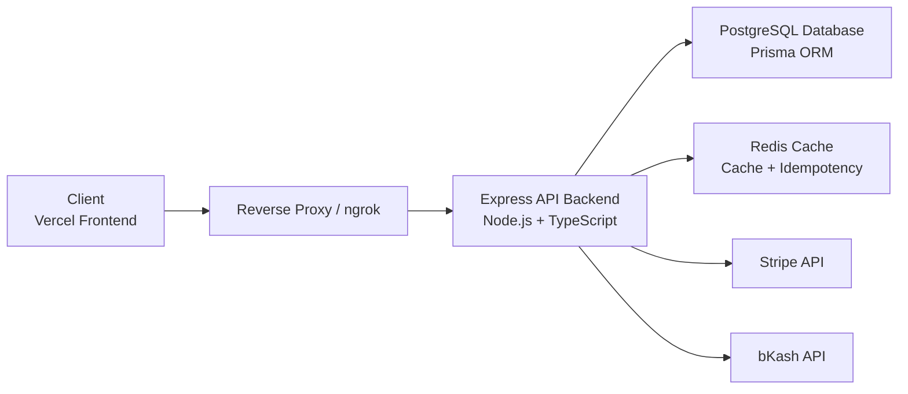
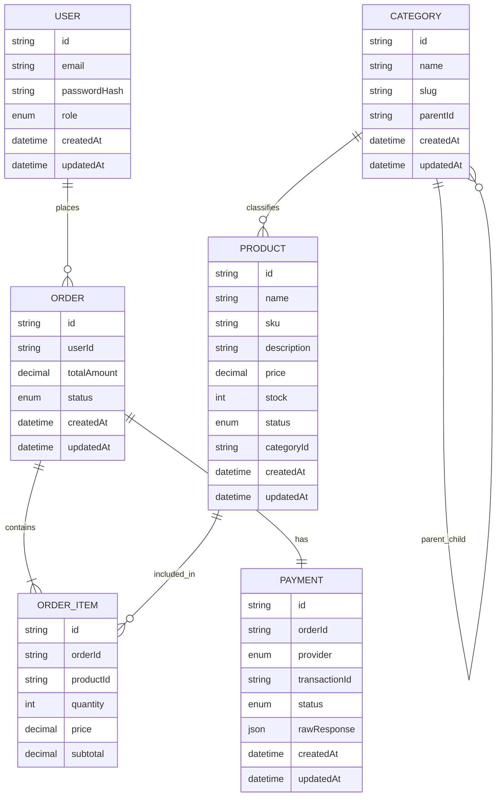
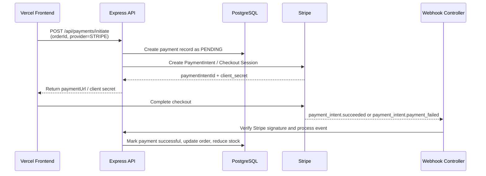
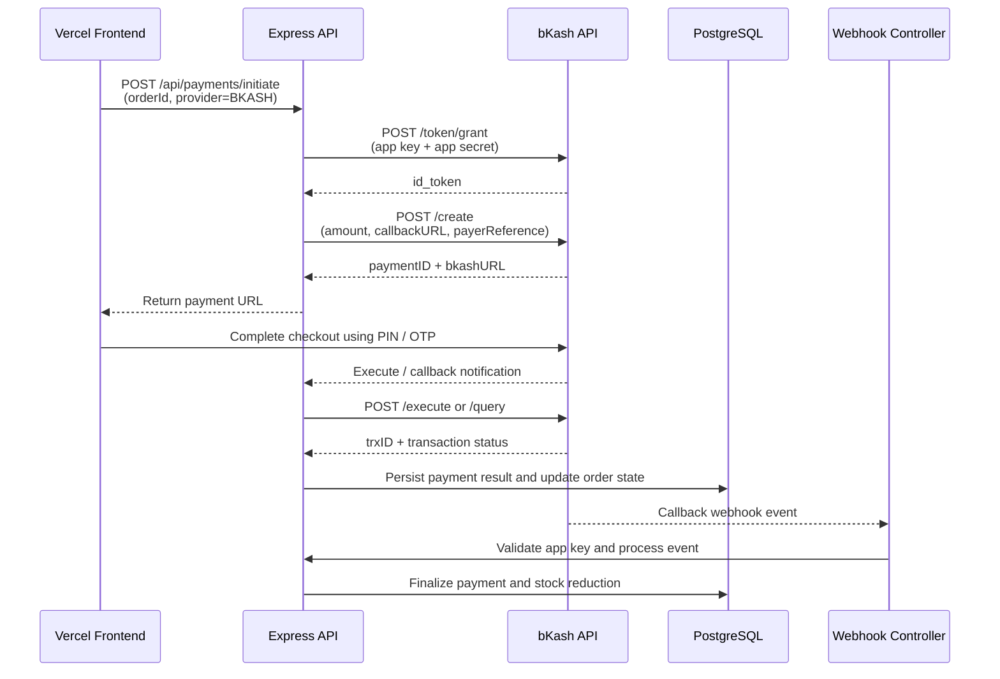

# System Architecture and Payment Flows

This document captures the runtime architecture, domain data model, and payment integration flows for the E-commerce Ordering & Payment System.

## 1. System Architecture

The application is structured as a modular Express + TypeScript backend that serves a frontend client, persists data in PostgreSQL, uses Redis for caching and idempotency, and integrates with external payment gateways such as Stripe and bKash.

### Runtime Responsibilities

- Client: Sends user requests for authentication, products, orders, and payments.
- Reverse Proxy / ngrok: Exposes the API securely for local development or external callbacks.
- Express API Backend: Handles routing, validation, business rules, authentication, and webhook processing.
- PostgreSQL: Stores persistent business data such as users, products, categories, orders, order items, and payments.
- Redis: Supports transient cache behavior and webhook idempotency protection.
- External Services: Stripe and bKash process payment initiation, verification, and webhook notifications.

---

## 2. Domain Entity Relationship Model

The Prisma schema defines a relational model for users, products, categories, orders, order items, and payments.

### Relationship Summary

- One user can place many orders.
- One category can contain many products, and categories can be nested.
- One order contains many order items.
- Each order item references one product.
- Each order has exactly one payment record.

---

## 3. Stripe Payment Flow

This flow covers payment intent creation on the backend, redirect/checkout completion on the frontend, and webhook execution for fulfillment.

### Stripe Notes

- The backend validates the webhook signature before acting on any event.
- Events are idempotently processed to prevent duplicate stock updates.
- Successful payment events trigger post-payment fulfillment logic.

---

## 4. bKash Payment Flow

This flow shows the bKash merchant checkout lifecycle from token generation through callback-based confirmation.

### bKash Notes

- The backend first requests a token before payment creation.
- The user completes the payment in the gateway UI.
- Webhook delivery and app-key validation are used to finalize the transaction safely.

---

## 5. Operational Considerations

- Use HTTPS for all public-facing endpoints and callback URLs.
- Protect webhook endpoints with signature or shared-key validation.
- Store payment state transitions immutably and deduplicate webhook events.
- Use Redis for short-lived locking and replay protection.
- Keep database transactions atomic when updating payments, orders, and inventory.
